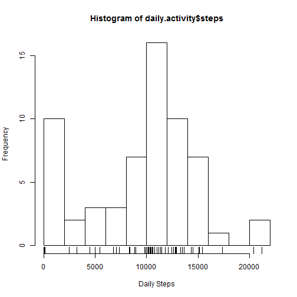
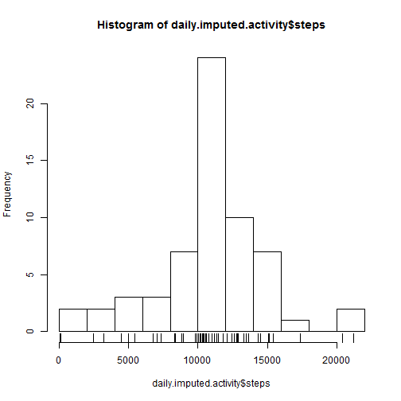
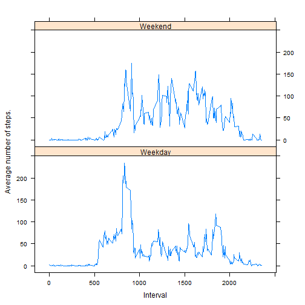

# Reproducible Research: Peer Assessment 1


## Loading and preprocessing the data

First we need to unzip the data and load csv to data frame.

```r
setwd("~/GitHub/RepData_PeerAssessment1")
unzip("activity.zip")
activity <- read.csv("activity.csv")
```


For speed and convenience, convert the 'activity' dataset into data.table format.

```r
require(data.table)
activity <- data.table(activity)
```


## What is mean total number of steps taken per day?

Make a histogram of daily ativity steps.

```r
# summarise activity
daily.activity <- activity[, list(steps = sum(steps, na.rm = T)), by = date]
hist(daily.activity$steps, breaks = 10, xlab = "Daily Steps")
rug(daily.activity$steps)
```

 


Calculate the mean and median of daily steps.

```r
mean.steps <- mean(daily.activity$steps)
median.steps <- median(daily.activity$steps)

sprintf("The mean number of steps per day is %.1f and the median is %d", mean.steps, 
    median.steps)
```

```
## [1] "The mean number of steps per day is 9354.2 and the median is 10395"
```


## What is the average daily activity pattern?

Average number of steps by interval accross all days.

```r
interval.activity <- activity[, list(avg.steps = mean(steps, na.rm = T)), by = interval]
```


Plot average number of steps by interval.

```r
with(interval.activity, plot(interval, avg.steps, type = "l", xlab = "Interval", 
    ylab = "Average number of steps"))
```

 


Find the interval with maximum average number of steps.

```r
sprintf("The interval with most steps on average is %d.", interval.activity[which.max(interval.activity$avg.steps), 
    interval])
```

```
## [1] "The interval with most steps on average is 835."
```


## Imputing missing values

Calculate the number of missing values.

```r
nmis <- sum(is.na(activity))
sprintf("The number of missing values is %d.", nmis)
```

```
## [1] "The number of missing values is 2304."
```


To impute missing number in the column 'steps' for any interval, we can use the mean value for that interval.


```r
# Set keys by which to merge
setkey(activity, interval)
setkey(interval.activity, interval)
# Merge
imputed.activity <- merge(activity, interval.activity, all.x = TRUE)
```


Now impute, where we replace any missing values by the average.

```r
imputed.activity$steps[is.na(imputed.activity$steps)] <- imputed.activity$avg.steps[is.na(imputed.activity$steps)]
imputed.activity$avg.steps <- NULL
```


The histogram of daily ativity steps now looks different. There is no longer a concentration of points near zero. The peak around the mean is also higher.

```r
# summarise activity
daily.imputed.activity <- imputed.activity[, list(steps = sum(steps, na.rm = T)), 
    by = date]
hist(daily.imputed.activity$steps, breaks = 10)
rug(daily.imputed.activity$steps)
```

 


Calculate the mean and median of daily steps

```r
with(daily.imputed.activity, sprintf("The mean number of steps per day is %.1f and the median is %.1f", 
    mean(steps), median(steps)))
```

```
## [1] "The mean number of steps per day is 10766.2 and the median is 10766.2"
```

Imputing missing values has increased both the mean and the median number of steps per day.


## Are there differences in activity patterns between weekdays and weekends?

To check if there are any differences in activity patterns between weekdays and weekends, we create weekday/weekend factor variable. Then plot the average number of steps by daily interval for each category.

```r
## Create function that determines whether it is a weekday or weekend
daytype <- function(date) {
    if (weekdays(date) %in% c("Saturday", "Sunday")) 
        "Weekend" else "Weekday"
}

activity$daytype <- as.factor(sapply(as.Date(activity$date), daytype))

interval.wk.activity <- activity[, list(avg.steps = mean(steps, na.rm = T)), 
    by = list(daytype, interval)]

library(lattice)
xyplot(avg.steps ~ interval | daytype, data = interval.wk.activity, type = "l", 
    layout = c(1, 2), xlab = "Interval", ylab = "Average number of steps.")
```

 


From the plot, it seems that the activity patterns between weekdays and weekends are indeed different. Whilst on weekdays there is high activity in the morning and low activity for the rest of the day, the weekend activity is much more uniform throughout the day.


